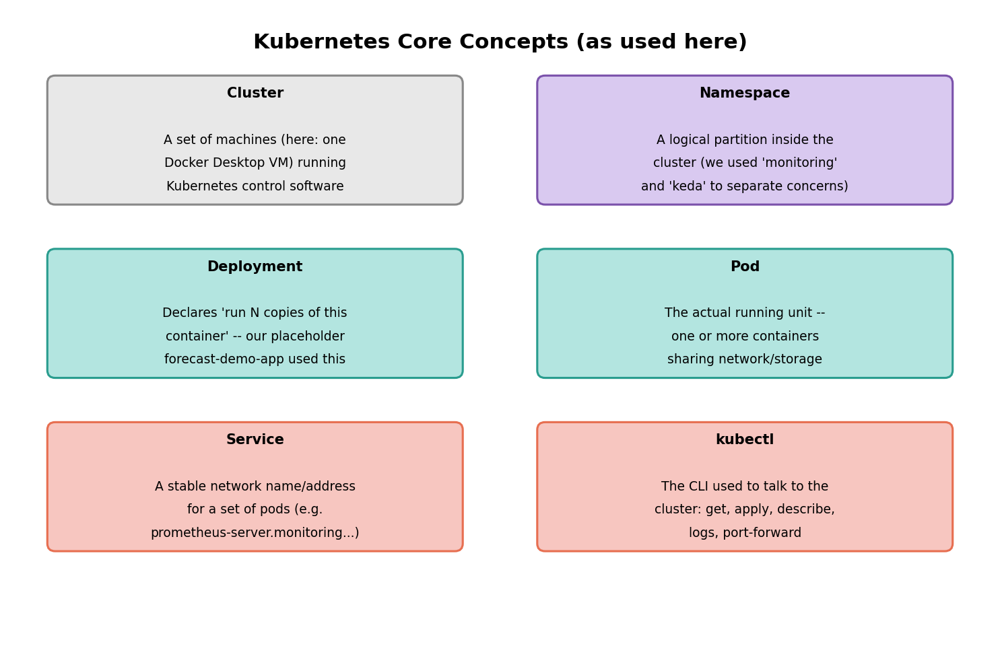
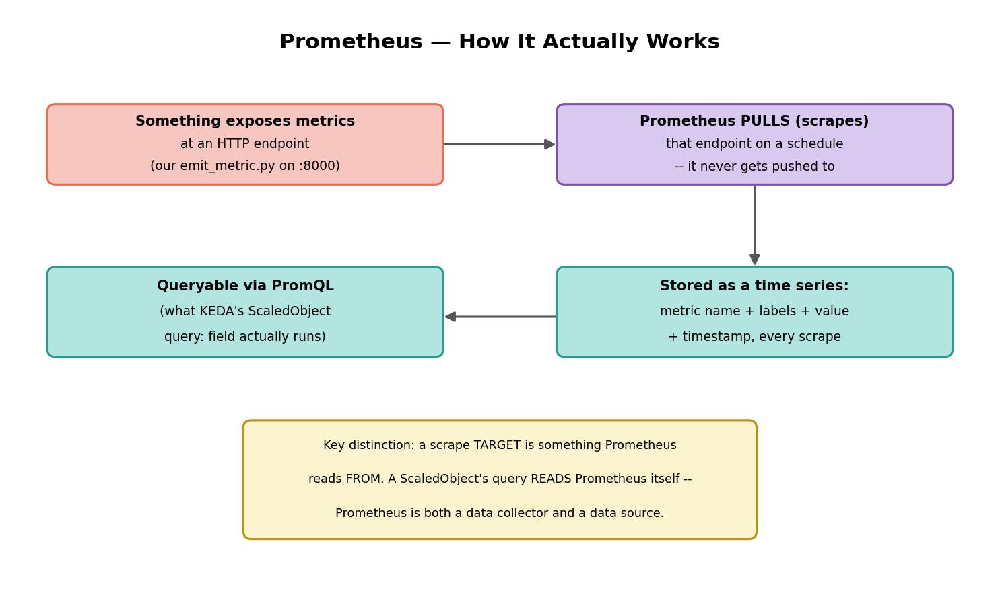
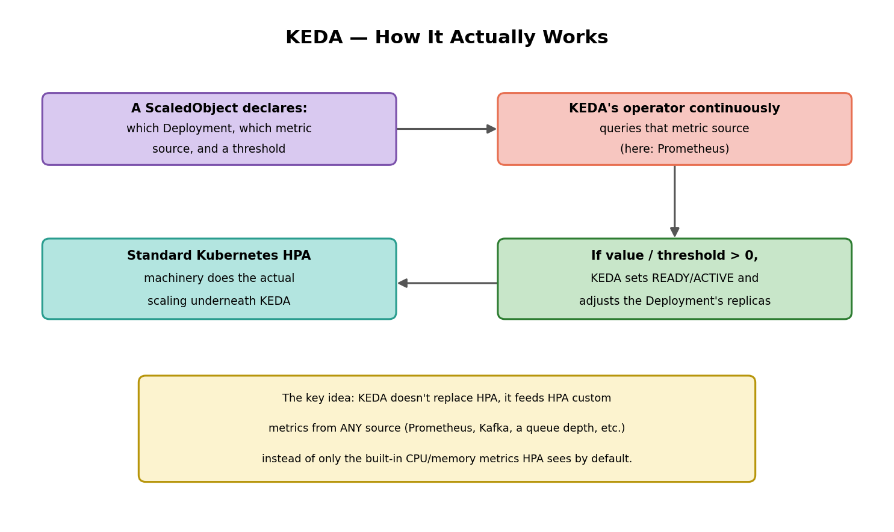
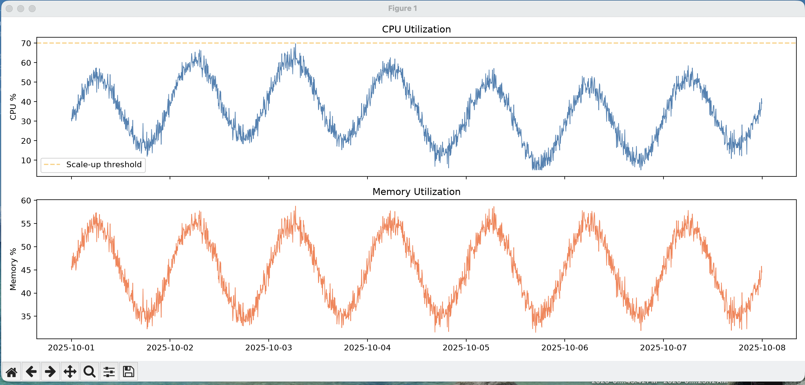
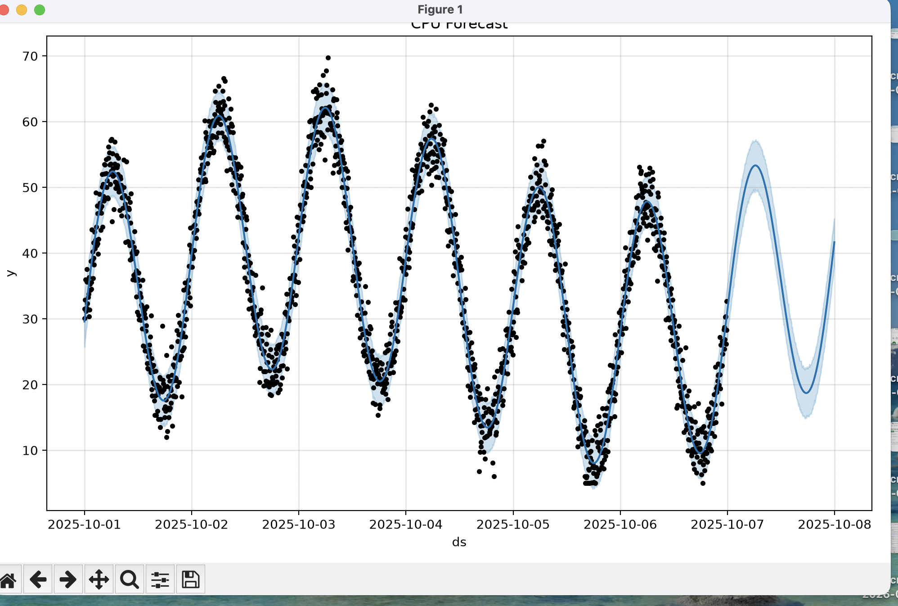
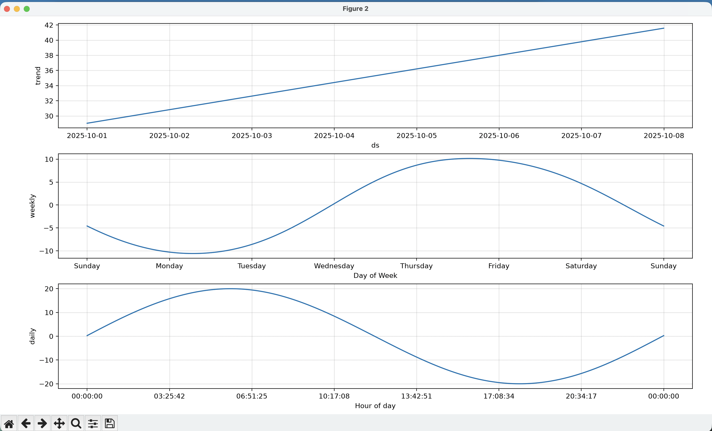
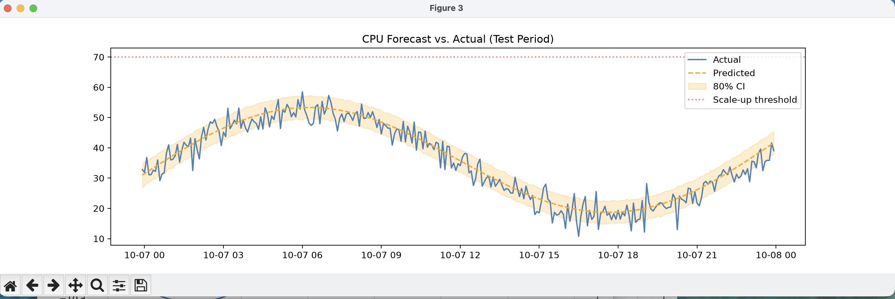
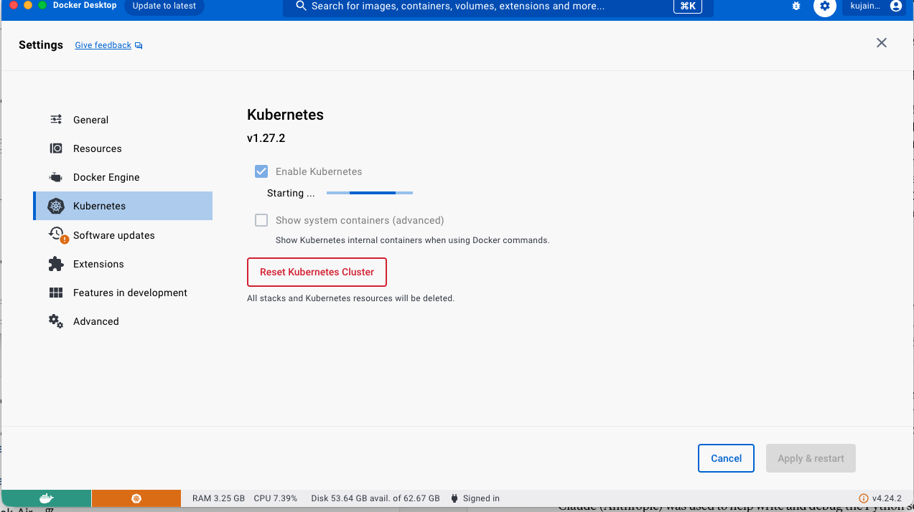
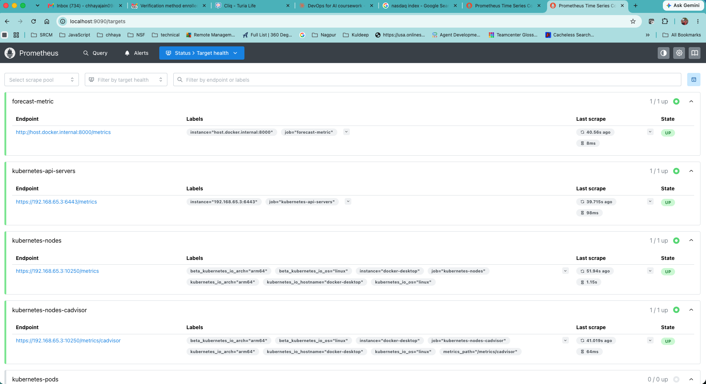
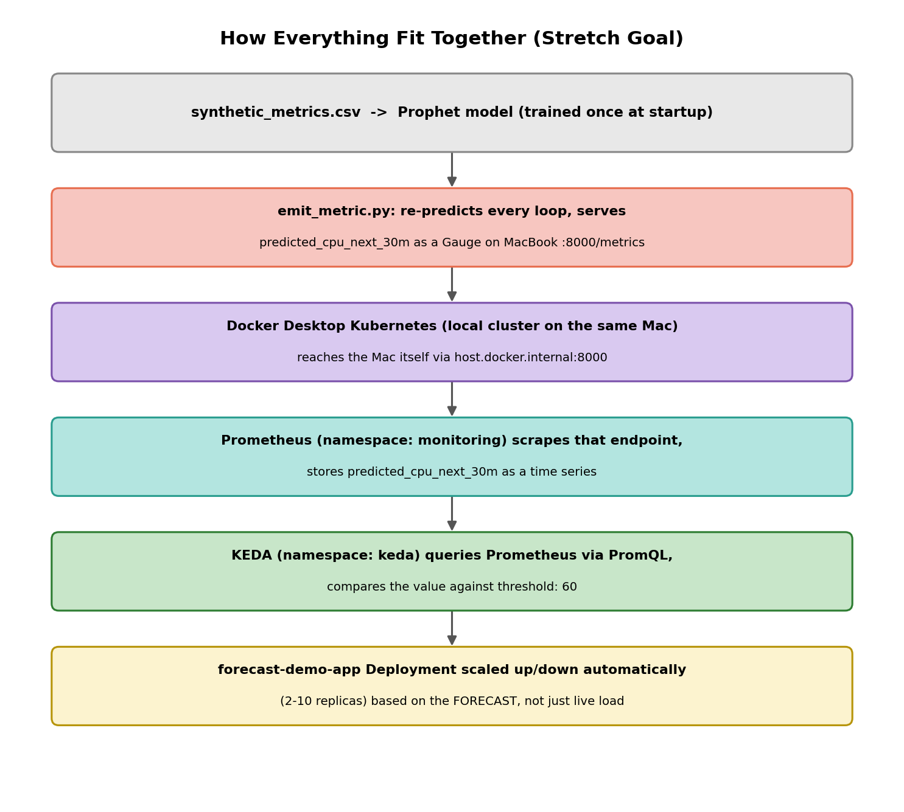

**CSE636 Week 4 --- Complete Reference**

*Time-Series Forecasting for Autoscaling: Concepts, Architecture, Full
Runbook, and the Prometheus + KEDA Stretch Goal*

Kuldeep Jain \| CSE636 --- DevOps with AI \| August 2026

*This document covers the full Week 4 Lab, core and stretch goal, done
entirely on a MacBook M1 (no GCP VM needed). It has four parts:
conceptual foundations (Kubernetes, Prometheus, KEDA), the core
forecasting pipeline with real screenshots, the complete command runbook
with exact virtual-environment requirements labeled, and an overall
integration overview tying every piece together.*

**Environment legend used throughout**

-   **🐍 venv-week4 ACTIVE:** this command needs Python packages
    (prophet, pandas, etc.) on the path.

-   **🐍 venv NOT needed:** plain shell, kubectl, helm, or curl commands
    work regardless of the Python venv\'s state.

## Part A --- Core Concepts

### A1. Kubernetes

Kubernetes is a system for running and managing containers across a
cluster of machines. For this lab, the \"cluster\" is a single-node
virtual cluster provided by Docker Desktop \-- everything runs on the
same MacBook, but through the same APIs and commands used against a real
multi-machine production cluster.

{width="6.3in"
height="4.072727471566054in"}

*Figure A1 --- The six Kubernetes concepts actually used in this lab.*

### A2. Prometheus

Prometheus is a monitoring system built around one core idea: it PULLS
metrics from things, on a schedule, rather than waiting for things to
push data to it. Anything that exposes a plain-text metrics page in
Prometheus\'s format can be \"scraped.\"

{width="6.3in"
height="3.7545450568678915in"}

*Figure A2 --- Prometheus\'s pull-based model, and why it can act as
both collector and data source.*

### A3. KEDA

KEDA (Kubernetes Event-Driven Autoscaling) extends Kubernetes\' built-in
autoscaling (HPA) to react to ANY metric source, not just the CPU/memory
metrics HPA sees by default. It doesn\'t replace HPA \-- it feeds HPA a
custom metric.

{width="6.3in"
height="3.7545450568678915in"}

*Figure A3 --- KEDA sits between an external metric source and standard
Kubernetes autoscaling.*

### A4. Why this matters for predictive autoscaling

Standard HPA is purely reactive \-- it scales based on CPU/memory AS
OBSERVED RIGHT NOW, which means there is always a lag between load
arriving and new pods becoming ready to handle it. KEDA\'s ability to
read an arbitrary metric means a FORECAST (like Prophet\'s
predicted_cpu_next_30m) can drive scaling instead of only the current,
already-happening load \-- the system can scale up ahead of a known
daily peak rather than reacting after it starts.

## Part B --- Core Lab: The Forecasting Pipeline

Done entirely on the MacBook M1 in a local Python virtual environment
(venv-week4) \-- no VM needed for this part.

### B1. Environment Setup

**🐍 venv NOT needed (plain shell/kubectl/helm command)**

> cd \~
>
> python3 -m venv venv-week4
>
> source venv-week4/bin/activate
>
> pip install prophet pandas matplotlib scikit-learn requests

Result: clean install, no compiler errors on Apple Silicon \-- prophet
1.3.0, cmdstanpy 1.3.0.

**🐍 venv-week4 ACTIVE**

> python3 -c \"import cmdstanpy; cmdstanpy.install_cmdstan()\"
>
> *Note: This compiles CmdStan itself (Prophet\'s actual math backend)
> \-- a separate step from pip install, and the step most likely to fail
> on Apple Silicon with compiler errors. It succeeded cleanly here.*

### B2. Generate the Dataset

**🐍 venv-week4 ACTIVE**

> cat \> generate_data.py \<\< \'EOF\'
>
> import pandas as pd
>
> import numpy as np
>
> np.random.seed(42) \# fixes the random generator so results are
> reproducible
>
> n_points = 2016 \# 7 days at 5-minute intervals: 7 \* 24 \* 12 = 2016
>
> timestamps = pd.date_range(start=\"2025-10-01\", periods=n_points,
> freq=\"5min\")
>
> \# NOTE: freq=\"5min\" not the original lab\'s \"5T\" \-- \"T\" is a
> deprecated
>
> \# pandas alias and fails/warns on recent pandas versions
>
> t = np.arange(n_points) \# \[0, 1, 2, \..., 2015\] \-- used as the
> \"clock\" for the sine waves
>
> daily_cycle = 20 \* np.sin(2 \* np.pi \* t / (24 \* 12)) \# completes
> 1 cycle every 288 points = 24h
>
> weekly_cycle = 10 \* np.sin(2 \* np.pi \* t / (7 \* 24 \* 12)) \#
> completes 1 cycle every 2016 points = 7 days
>
> noise = np.random.normal(0, 3, n_points) \# random jitter, mean 0, std
> 3
>
> trend = 0.005 \* t \# slow linear drift upward over the week
>
> cpu = np.clip(30 + daily_cycle + weekly_cycle + noise + trend, 5, 95)
>
> memory = np.clip(45 + 0.5 \* daily_cycle + noise \* 0.5, 20, 90)
>
> df_sim = pd.DataFrame({\"ds\": timestamps, \"cpu\": cpu, \"memory\":
> memory})
>
> df_sim.to_csv(\"synthetic_metrics.csv\", index=False)
>
> print(\"Generated synthetic_metrics.csv with\", len(df_sim), \"rows\")
>
> EOF
>
> python3 generate_data.py

Verified: 2017 lines (2016 rows + header), spanning exactly 2025-10-01
00:00:00 to 2025-10-07 23:55:00.

### B3. Explore and Visualize

**🐍 venv-week4 ACTIVE**

{width="6.3in"
height="3.0151924759405073in"}

*Figure B1 --- Actual output: 7 clean daily cycles visible in CPU (top)
and memory (bottom), with a slight upward drift and visible weekly
modulation in peak heights.*

This confirmed the data generation matched its design intent BEFORE
spending time training a model on it \-- 7 visible peaks, the weekly
cycle\'s influence on peak height (notice Oct 3\'s peak is taller than
Oct 1\'s), and troughs gradually rising over the week from the trend
term.

### B4. Train the Prophet Model

**🐍 venv-week4 ACTIVE**

> cat \> forecast_and_eval.py \<\< \'EOF\'
>
> import pandas as pd
>
> import matplotlib.pyplot as plt
>
> from prophet import Prophet
>
> from sklearn.metrics import mean_absolute_error,
> mean_absolute_percentage_error
>
> df = pd.read_csv(\"synthetic_metrics.csv\", parse_dates=\[\"ds\"\])
>
> \# Prophet requires exactly two columns named \'ds\' and \'y\'
>
> cpu_df = df\[\[\"ds\", \"cpu\"\]\].rename(columns={\"cpu\": \"y\"})
>
> \# Temporal split \-- train only on the PAST, test on the FUTURE
> (never
>
> \# shuffle-split time series, unlike typical i.i.d. ML data)
>
> split_time = cpu_df\[\"ds\"\].max() - pd.Timedelta(\"24h\")
>
> train = cpu_df\[cpu_df\[\"ds\"\] \< split_time\].copy()
>
> test = cpu_df\[cpu_df\[\"ds\"\] \>= split_time\].copy()
>
> print(f\"Training on {len(train)} points, evaluating on {len(test)}
> points\")
>
> model = Prophet(
>
> daily_seasonality=True, \# matches the daily_cycle we built in
>
> weekly_seasonality=True, \# matches the weekly_cycle we built in
>
> yearly_seasonality=False, \# only 7 days of data \-- no yearly pattern
> learnable
>
> interval_width=0.80 \# 80% confidence interval on every prediction
>
> )
>
> model.fit(train) \# this is where CmdStan actually does the heavy
> computation
>
> \# IMPORTANT FIX: periods=len(test), not periods=12 as the original
> lab
>
> \# doc shows \-- periods=12 only forecasts 1 hour ahead, but the
> evaluation
>
> \# below needs predictions covering the FULL 24-hour test set (289
> points)
>
> future = model.make_future_dataframe(periods=len(test), freq=\"5min\")
>
> forecast = model.predict(future)
>
> fig = model.plot(forecast)
>
> plt.title(\"CPU Forecast\")
>
> plt.savefig(\"cpu_forecast.png\", dpi=120)
>
> fig2 = model.plot_components(forecast)
>
> plt.savefig(\"cpu_forecast_components.png\", dpi=120)
>
> EOF

{width="6.3in"
height="4.248396762904637in"}

*Figure B2 --- Actual output: predicted line (blue) tracking the real
noisy data (black dots) closely across all 7 days, with the confidence
band appropriately widening into the forecast region.*

{width="6.3in"
height="3.8193744531933507in"}

*Figure B3 --- Actual output: Prophet correctly decomposed the single
CPU series back into trend (\~29 to \~42), weekly (trough Mon/Tue, peak
Thu/Fri), and daily (peak \~06:51, trough \~17:08) --- matching the
synthetic data\'s design almost exactly, despite never being told these
components existed separately.*

### B5. Evaluate Forecast Accuracy

**🐍 venv-week4 ACTIVE**

> \# appended to the same forecast_and_eval.py script
>
> test_forecast = forecast\[forecast\[\"ds\"\].isin(test\[\"ds\"\])\]
>
> actual = test\[\"y\"\].values
>
> predicted = test_forecast\[\"yhat\"\].values
>
> mae = mean_absolute_error(actual, predicted)
>
> mape = mean_absolute_percentage_error(actual, predicted) \* 100
>
> print(f\"MAE: {mae:.2f}% CPU\")
>
> print(f\"MAPE: {mape:.1f}%\")
>
> fig, ax = plt.subplots(figsize=(14, 4))
>
> ax.plot(test\[\"ds\"\], actual, label=\"Actual\", color=\"steelblue\")
>
> ax.plot(test_forecast\[\"ds\"\], predicted, label=\"Predicted\",
> color=\"orange\", linestyle=\"\--\")
>
> ax.fill_between(test_forecast\[\"ds\"\],
> test_forecast\[\"yhat_lower\"\], test_forecast\[\"yhat_upper\"\],
>
> alpha=0.2, color=\"orange\", label=\"80% CI\")
>
> ax.axhline(70, color=\"red\", linestyle=\":\", alpha=0.5,
> label=\"Scale-up threshold\")
>
> ax.legend()
>
> plt.savefig(\"cpu_eval.png\", dpi=120)

{width="6.3in"
height="2.1045067804024495in"}

*Figure B4 --- Actual output: Actual vs. Predicted over the full 24-hour
test window. Result: MAE 2.44% CPU, MAPE 8.7% --- a strong result, under
the 10% MAPE commonly treated as "highly accurate".*

### B6. Translate Forecast into a Scaling Decision

**🐍 venv-week4 ACTIVE**

> import math
>
> def recommend_replicas(forecast_df, current_replicas,
> target_cpu_pct=60,
>
> horizon_minutes=30, min_replicas=2, max_replicas=50):
>
> \# anchored to the last known data point, not real-world \"now\" \--
> the
>
> \# synthetic data is dated Oct 2025, so pd.Timestamp.now() would find
>
> \# nothing \"upcoming\" in the dataset at all
>
> now = forecast_df\[\"ds\"\].max() -
> pd.Timedelta(minutes=horizon_minutes + 5)
>
> cutoff = now + pd.Timedelta(minutes=horizon_minutes)
>
> upcoming = forecast_df\[(forecast_df\[\"ds\"\] \> now) &
> (forecast_df\[\"ds\"\] \<= cutoff)\]
>
> if upcoming.empty:
>
> upcoming = forecast_df.tail(horizon_minutes // 5)
>
> \# yhat_upper (not the point estimate yhat): a safety margin, since
>
> \# under-provisioning hurts users more than slight over-provisioning
>
> max_cpu = upcoming\[\"yhat_upper\"\].max()
>
> \# ceil: can\'t run a fractional replica; rounding down would
> under-provision
>
> recommended = math.ceil(current_replicas \* max_cpu / target_cpu_pct)
>
> \# clamp so a wild forecast can\'t scale to zero or to thousands of
> pods
>
> recommended = max(min_replicas, min(max_replicas, recommended))
>
> return recommended, max_cpu
>
> current = 4
>
> recommended, max_cpu_pred = recommend_replicas(forecast,
> current_replicas=current)
>
> print(f\"Recommended replicas: {recommended}\")

Result: 3 recommended replicas (down from 4) \-- max predicted CPU
(45.0%) was comfortably below the 60% target, so the model correctly
identified this window as over-provisioned.

## Part C --- Stretch Goal: Prometheus + KEDA

Everything below still runs on the same MacBook \-- Docker Desktop\'s
built-in Kubernetes, not a separate VM or cloud cluster.

### C1. Enable Kubernetes in Docker Desktop

{width="6.3in"
height="3.5335433070866142in"}

*Figure C1 --- Docker Desktop Settings -\> Kubernetes, mid-startup after
checking "Enable Kubernetes" for the first time.*

**🐍 venv NOT needed (plain shell/kubectl/helm command)**

> kubectl get nodes
>
> \# Confirmed once ready: docker-desktop Ready control-plane 64s
> v1.27.2

### C2. Install Helm, Prometheus, and KEDA

**🐍 venv NOT needed (plain shell/kubectl/helm command)**

> brew install helm
>
> helm repo add prometheus-community
> https://prometheus-community.github.io/helm-charts
>
> helm repo update
>
> \# Standalone Prometheus chart, NOT the full kube-prometheus-stack \--
>
> \# lighter weight, since Grafana/Alertmanager/exporters aren\'t needed
> here
>
> helm install prometheus prometheus-community/prometheus \--namespace
> monitoring \--create-namespace
>
> helm repo add kedacore https://kedacore.github.io/charts
>
> helm repo update
>
> helm install keda kedacore/keda \--namespace keda \--create-namespace
>
> kubectl get pods -n monitoring
>
> kubectl get pods -n keda

Result: all pods in both namespaces reached Running (prometheus-server
showed 2/2 once its config-reload sidecar became ready; KEDA\'s operator
had one benign restart during first-time webhook cert setup, then
stabilized).

### C3. Emit the Forecast as a Prometheus Metric

**🐍 venv-week4 ACTIVE**

> cat \> emit_metric.py \<\< \'EOF\'
>
> import math, time
>
> import pandas as pd
>
> from prophet import Prophet
>
> from prometheus_client import Gauge, start_http_server
>
> \# Train ONCE at startup (reusing the Step 3 logic) \-- NOT retraining
>
> \# every loop, matching the lab\'s own \"retrain periodically\"
> guidance
>
> df = pd.read_csv(\"synthetic_metrics.csv\", parse_dates=\[\"ds\"\])
>
> cpu_df = df\[\[\"ds\", \"cpu\"\]\].rename(columns={\"cpu\": \"y\"})
>
> model = Prophet(daily_seasonality=True, weekly_seasonality=True,
>
> yearly_seasonality=False, interval_width=0.80)
>
> model.fit(cpu_df) \# trained on the FULL dataset here \-- this
> script\'s
>
> \# job is live serving, not held-out evaluation
>
> def recommend_replicas(forecast_df, current_replicas,
> target_cpu_pct=60,
>
> horizon_minutes=30, min_replicas=2, max_replicas=50):
>
> now = forecast_df\[\"ds\"\].max() -
> pd.Timedelta(minutes=horizon_minutes + 5)
>
> cutoff = now + pd.Timedelta(minutes=horizon_minutes)
>
> upcoming = forecast_df\[(forecast_df\[\"ds\"\] \> now) &
> (forecast_df\[\"ds\"\] \<= cutoff)\]
>
> if upcoming.empty:
>
> upcoming = forecast_df.tail(horizon_minutes // 5)
>
> max_cpu = upcoming\[\"yhat_upper\"\].max()
>
> recommended = math.ceil(current_replicas \* max_cpu / target_cpu_pct)
>
> return max(min_replicas, min(max_replicas, recommended)), max_cpu
>
> start_http_server(8000) \# opens the /metrics HTTP endpoint on port
> 8000
>
> \# A Gauge can go up AND down (unlike a Counter, which only increases)
> \--
>
> \# correct choice since predicted CPU can rise or fall between updates
>
> predicted_cpu_gauge = Gauge(
>
> \"predicted_cpu_next_30m\",
>
> \"Prophet-predicted max CPU % for next 30 minutes\",
>
> \[\"service\"\] \# label lets this metric name be reused per-service
> later
>
> )
>
> print(\"Emitting Prometheus metrics on :8000/metrics \...\")
>
> while True:
>
> future = model.make_future_dataframe(periods=12, freq=\"5min\")
>
> fresh_forecast = model.predict(future) \# re-PREDICT, not re-TRAIN
>
> \_, max_pred = recommend_replicas(fresh_forecast, current_replicas=4)
>
> predicted_cpu_gauge.labels(service=\"my-app\").set(max_pred) \# .set()
> overwrites the value
>
> print(f\"Emitted predicted_cpu_next_30m = {max_pred:.1f}%\")
>
> time.sleep(300) \# update every 5 minutes
>
> EOF
>
> pip install prometheus_client
>
> python3 emit_metric.py

Result: "Emitting Prometheus metrics on :8000/metrics \..." then
"Emitted predicted_cpu_next_30m = 48.6%". Left running in its own
terminal.

### C4. Verify the Metric is Actually Being Served

**🐍 venv NOT needed (plain shell/kubectl/helm command)**

> curl http://localhost:8000/metrics \| grep predicted_cpu
>
> \# predicted_cpu_next_30m{service=\"my-app\"} 48.864526896969856

### C5. Point Prometheus at the Local Script

**🐍 venv NOT needed (plain shell/kubectl/helm command)**

emit_metric.py runs on the Mac itself, while Prometheus runs INSIDE the
Kubernetes cluster \-- from inside a pod, localhost refers to that pod,
not the Mac. Docker Desktop provides host.docker.internal specifically
to resolve back to the host machine from inside any container.

> cat \> prometheus-scrape-values.yaml \<\< \'EOF\'
>
> extraScrapeConfigs: \|
>
> \- job_name: \'forecast-metric\'
>
> static_configs:
>
> \- targets: \[\'host.docker.internal:8000\'\]
>
> EOF
>
> helm upgrade prometheus prometheus-community/prometheus \\
>
> \--namespace monitoring \\
>
> -f prometheus-scrape-values.yaml
>
> kubectl port-forward -n monitoring svc/prometheus-server 9090:80

{width="6.3in"
height="3.431279527559055in"}

*Figure C2 --- Actual result at localhost:9090/targets: forecast-metric
shown UP (1/1), alongside Kubernetes\' own auto-discovered targets
(api-servers, nodes, cadvisor) all healthy --- confirming the whole
monitoring stack, not just the custom metric, was working correctly.*

### C6. Placeholder Deployment and the KEDA ScaledObject

**🐍 venv NOT needed (plain shell/kubectl/helm command)**

> cat \> placeholder-deployment.yaml \<\< \'EOF\'
>
> \# Minimal placeholder \-- KEDA needs a REAL Deployment to scale
> against.
>
> \# nginx has no functional role in the forecasting demo; it just needs
>
> \# to exist so there\'s something to observe scaling
>
> apiVersion: apps/v1
>
> kind: Deployment
>
> metadata:
>
> name: forecast-demo-app
>
> spec:
>
> replicas: 2
>
> selector:
>
> matchLabels: { app: forecast-demo-app }
>
> template:
>
> metadata:
>
> labels: { app: forecast-demo-app }
>
> spec:
>
> containers:
>
> \- name: nginx
>
> image: nginx:alpine
>
> resources:
>
> requests: { cpu: 10m, memory: 16Mi }
>
> EOF
>
> kubectl apply -f placeholder-deployment.yaml
>
> cat \> scaledobject.yaml \<\< \'EOF\'
>
> apiVersion: keda.sh/v1alpha1
>
> kind: ScaledObject
>
> metadata:
>
> name: forecast-scaledobject
>
> spec:
>
> scaleTargetRef:
>
> name: forecast-demo-app
>
> minReplicaCount: 2
>
> maxReplicaCount: 10
>
> triggers:
>
> \- type: prometheus
>
> metadata:
>
> serverAddress: http://prometheus-server.monitoring.svc.cluster.local
>
> metricName: predicted_cpu_next_30m
>
> \# threshold is PER-REPLICA, same idea as target_cpu_pct=60 in
>
> \# recommend_replicas() \-- KEDA divides metric value by this
>
> threshold: \"60\"
>
> query: predicted_cpu_next_30m{service=\"my-app\"}
>
> EOF
>
> kubectl apply -f scaledobject.yaml
>
> kubectl get scaledobject
>
> NAME SCALETARGETKIND SCALETARGETNAME MIN MAX READY ACTIVE FALLBACK
> TRIGGERS
>
> forecast-scaledobject apps/v1.Deployment forecast-demo-app 2 10 True
> True False prometheus

READY: True confirmed KEDA successfully connected to Prometheus and
parsed the query. ACTIVE: True confirmed the live forecast value was, at
the time of checking, at or above the configured scaling threshold \-- a
genuinely working, live decision, verified stable over 16+ minutes, not
a correctly-configured but idle setup.

## Part D --- Overall Integration: How Every Piece Fit Together

{width="5.8in"
height="5.214141513560805in"}

*Figure D1 --- The complete data flow, from the raw synthetic CSV to an
actual Kubernetes Deployment scaling on a forecast.*

The core Lab (Parts B) and the stretch goal (Part C) are the same
underlying idea at two different levels of maturity. Part B computes a
scaling recommendation once, as a Python calculation you read from
console output \-- useful for understanding and validating the
forecasting approach, but not something a real system could act on
automatically. Part C takes the identical model and logic and turns it
into a continuously running control loop: the forecast is served as a
live metric, a real monitoring system (Prometheus) continuously collects
it, and a real Kubernetes autoscaling mechanism (KEDA) continuously
evaluates and acts on it \-- closing the loop from "the model made a
prediction" to "the platform is prepared to act on that prediction
automatically," with zero manual intervention after setup.

This distinction \-- a one-off calculation vs. a live, closed control
loop \-- is directly the difference between traditional reactive HPA
(which only ever sees current, already-happening load) and genuine
predictive autoscaling. The Assignment\'s core question ("does AI
forecasting improve on reactive HPA, and under what conditions?") can
now be answered with reference to a real, working example rather than
only a theoretical description.

**Summary of what each tool contributed**

-   **Prophet:** learned the recurring daily/weekly pattern from
    historical data and produces both a point estimate and a confidence
    interval \-- the actual predictive intelligence.

-   **Docker Desktop\'s Kubernetes:** provided the compute environment
    (a real, if local, Kubernetes cluster) that any of this would need
    to run against in production.

-   **Prometheus:** turned the forecast into a standard, queryable
    time-series metric \-- the same mechanism production infrastructure
    already uses for every other metric.

-   **KEDA:** bridged that metric to Kubernetes\' native autoscaling
    machinery, without requiring the application itself to know anything
    about forecasting.
