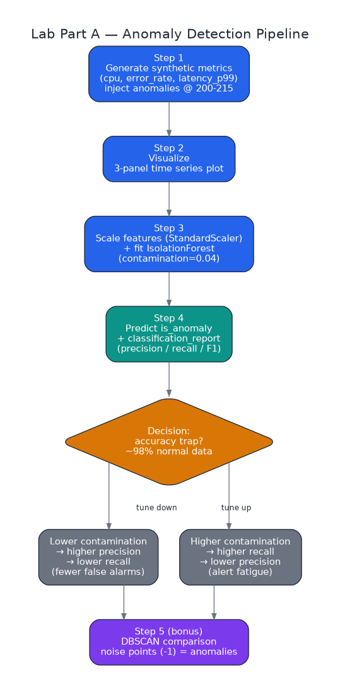
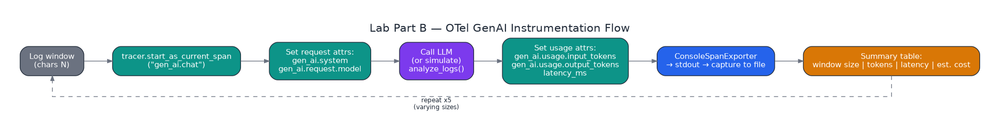
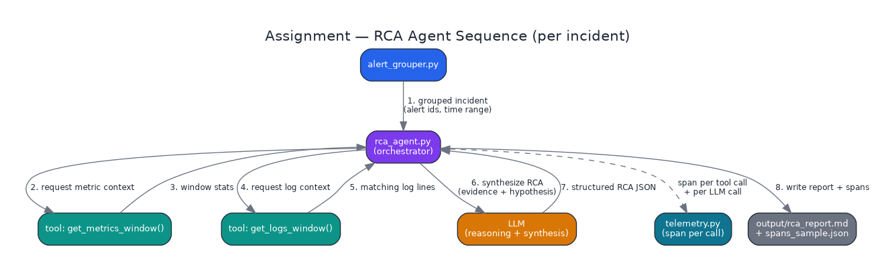

# Week 5 — Complete Step-by-Step Guide

**Setup → Lab Part A → Lab Part B → Assignment → Submission**
CSE636 — DevOps for AI | Includes real bugs hit and how they were fixed

> Images in this file are linked, not embedded — place the `diagrams/` folder next to this file (see the note at the end) and open in VS Code's Markdown Preview (`Cmd+Shift+V`) to see them render.

---

## Before you start

### Will this fit in your Pro subscription?

Yes. Claude Pro is message-based (roughly 40–45 messages per rolling 5-hour window), not billed per token like the API. This whole guide is one working session. If you separately call the real Claude API from `rca_agent.py` for actual RCA text, that's billed at standard API rates — a few days of testing runs under $2.

### Reusing Week 0-4 setup

- Your `venv-week4` local Python environment reuses cleanly — no VM needed.
- The Week 4 Kubernetes/Grafana stretch-goal setup is optional — only useful if you want spans visualized instead of a plain JSON file.
- Your `cse636-coursework` repo is still the right place — add a `week-05/` subfolder, same pattern as Weeks 3 and 4.

### How this guide is organized

Every step block starts with a short **"Before you begin"** line telling you exactly which terminal, folder, and file you should have open. 💡 **Concept** callouts explain an idea right before the code that uses it. ⚠️ **Real bug we hit** callouts flag an actual problem encountered while building this guide, exactly where it would bite you, with the fix.

---

## 1. Setup

*Before you begin: Open a fresh terminal window. You don't need to be inside any project folder yet.*

### Step 1 — Activate your Python environment

If you already have `venv-week4` from Week 4, reuse it. If not, create a new one the same way.

```bash
source ~/venv-week4/bin/activate
# Prompt should now show (venv-week4) at the start of the line
```

### Step 2 — Install what you need

```bash
pip install numpy pandas matplotlib scikit-learn opentelemetry-sdk opentelemetry-api
```

One line covers everything for both the Lab and the Assignment.

> 💡 **Concept: Why these specific packages**
> numpy/pandas generate and hold the fake metrics data. matplotlib draws the charts. scikit-learn provides IsolationForest and DBSCAN, the two anomaly-detection algorithms you'll compare. opentelemetry-sdk/api provide the tracing library used to record how long each step of the agent takes and how many tokens it uses — the same kind of instrumentation a real production system uses to answer "why is this slow / expensive" after the fact.

### Step 3 — Create a folder to work in

```bash
mkdir week-05 && cd week-05
mkdir data src notebooks output
```

`data/`, `src/`, and `output/` get filled in as you go through the Assignment (Section 4) — creating them now saves a step later.

### Step 4 — Sanity-check the environment

```bash
python3 -c "import sklearn, pandas, opentelemetry; print('ok')"
```

If that prints `ok` with no errors, you're ready for Part A.

> ⚠️ **Real bug we hit: pandas 3.0 is a very recent major version**
> If anything in Part A's data-generation code throws an unexpected error, it's likely a pandas 3.0 API change, not a mistake in the code. Specifically: if `pd.date_range(..., freq="1min")` throws a warning or error, try `freq="min"` instead — that's the more recent alias.

---

## 2. Lab Part A — Anomaly Detection

*Before you begin: Same terminal, still inside `week-05/` with `venv-week4` active. Launch Jupyter and open (or create) the notebook.*

```bash
jupyter notebook notebooks/
# In the browser tab that opens: click New -> Python 3
# Click the "Untitled" title at the top, rename it to "analysis"
# It saves automatically as notebooks/analysis.ipynb
```

If `notebooks/analysis.ipynb` already exists (e.g. from a previous session), open it directly instead: `jupyter notebook notebooks/analysis.ipynb`

What you're building: a small pipeline that makes up fake server metrics, plants a fake incident in the middle of them, then uses a model to find it.


*The 5 steps below, visually — generate, plot, detect, score, tune.*

> 💡 **Concept: What is anomaly detection, and why unsupervised?**
> You're not telling the model what an anomaly looks like — there's no labeled training set of "past incidents." Instead, the model learns what normal looks like from the bulk of the data and flags points that don't fit. This matters because in real systems you rarely have enough labeled incidents to train a supervised classifier, but you always have plenty of "normal" telemetry to learn from.

### Step 1 — Set the notebook's working directory (first cell)

In the very first cell of the notebook, run this once so all later file paths (`data/...`, `output/...`) resolve correctly no matter where Jupyter itself was launched from:

```python
import os
os.chdir(os.path.expanduser("~/week-05"))
print(os.getcwd())
```

### Step 2 — Generate the fake data

New cell. Creates 500 minutes of normal-looking metrics, then overwrites minutes 200–215 with obviously abnormal numbers — that's your "incident" to find later.

```python
import numpy as np
import pandas as pd

rng = np.random.default_rng(42)   # fixed seed so results are repeatable
n = 500

timestamps = pd.date_range("2025-10-01 08:00", periods=n, freq="1min")
cpu = rng.normal(35, 5, n)                # normal CPU: ~35%, some noise
error_rate = rng.exponential(0.002, n)    # normal error rate: very low
latency_p99 = rng.normal(150, 20, n)      # normal p99 latency: ~150ms

# Overwrite minutes 200-215 with an obvious spike (the "incident")
cpu[200:216] = rng.normal(85, 5, 16)
error_rate[200:216] = rng.uniform(0.05, 0.15, 16)
latency_p99[200:216] = rng.normal(3500, 200, 16)

df = pd.DataFrame({
    "timestamp": timestamps,
    "cpu_pct": np.clip(cpu, 0, 100),
    "error_rate": np.clip(error_rate, 0, 1),
    "latency_p99_ms": np.clip(latency_p99, 0, None),
})
df.to_csv("data/metrics_sample.csv", index=False)
df.head()
```

### Step 3 — Plot it

```python
import matplotlib.pyplot as plt

fig, axes = plt.subplots(3, 1, figsize=(14, 8), sharex=True)
df.set_index("timestamp")[["cpu_pct"]].plot(ax=axes[0], title="CPU %")
df.set_index("timestamp")[["error_rate"]].plot(ax=axes[1], title="Error Rate", color="red")
df.set_index("timestamp")[["latency_p99_ms"]].plot(ax=axes[2], title="Latency p99 (ms)", color="orange")
plt.tight_layout()
plt.savefig("metrics_overview.png", dpi=150)
plt.show()
```

You should see a clear bump in the middle of each chart. If not, re-run Step 2 — the data didn't generate correctly.

> 💡 **Concept: Isolation Forest, in plain terms**
> The core idea: anomalies are easier to isolate than normal points. The algorithm builds random decision trees that repeatedly split the data on random features at random thresholds. A normal point, surrounded by similar points, takes many splits to isolate into its own leaf. An outlier — sitting far from the crowd — tends to get isolated in just a few splits. Average that "splits to isolate" number across many trees, invert it, and you get an anomaly score. The `contamination` parameter tells the model what fraction of the data to expect as anomalous, which sets the threshold on that score.

### Step 4 — Run the detector

```python
from sklearn.ensemble import IsolationForest
from sklearn.preprocessing import StandardScaler

features = df[["cpu_pct", "error_rate", "latency_p99_ms"]]
X = StandardScaler().fit_transform(features)   # put all 3 metrics on the same scale

model = IsolationForest(n_estimators=200, contamination=0.04, random_state=42)
model.fit(X)

df["is_anomaly"] = (model.predict(X) == -1)    # -1 means "flagged as anomaly"
print(f"Anomalies detected: {df['is_anomaly'].sum()} of {len(df)} points")
```

Verified output: `Anomalies detected: 20 of 500 points`.

> 💡 **Concept: Why precision/recall, not accuracy**
> This dataset is ~98% normal (484 of 500 points). A detector that predicts "normal" for everything scores ~98% accuracy while catching zero real anomalies — useless. That's why the evaluation below reports precision and recall for the Anomaly class specifically:
> - **Precision** — of the points flagged as anomalies, how many really were? Low precision = lots of false alarms.
> - **Recall** — of the real anomalies, how many did the model catch? Low recall = missed incidents.
>
> Tuning `contamination` is really tuning this precision ↔ recall trade-off: lower contamination → pickier model → higher precision, lower recall. Higher contamination → flags more liberally → higher recall, lower precision.

### Step 5 — Score it

```python
from sklearn.metrics import classification_report

ground_truth = [1 if 200 <= i <= 215 else 0 for i in range(len(df))]
predictions = df["is_anomaly"].astype(int).tolist()

print(classification_report(ground_truth, predictions, target_names=["Normal", "Anomaly"]))
```

Verified output at `contamination=0.04`:

```
              precision    recall  f1-score   support

      Normal       1.00      0.99      1.00       484
     Anomaly       0.80      1.00      0.89        16
```

#### Reading the Normal vs. Anomaly rows

Both rows come from the exact same confusion matrix — just read from opposite corners. One mistake (a real anomaly predicted as normal) is simultaneously a false negative for Anomaly AND a false positive for Normal. Same event, two labels, depending on which class you're scoring:

| Lens | TP | FP | FN | TN | Precision | Recall |
|---|---|---|---|---|---|---|
| Anomaly (contamination=0.04) | 16 | 4 | 0 | 480 | 0.80 | 1.00 |
| Normal (contamination=0.04) | 480 | 0 | 4 | 16 | 1.00 | 0.99 |

Why Normal barely moves across settings: with only 16 true anomalies out of 500, "predict Normal" is right 96.8% of the time no matter what the model does — the majority class is inherently easy to score well on. All the real signal about whether the detector works lives in the Anomaly row, which is why that's the one worth reading closely.

### Step 6 — Try 3 different settings

Change `contamination` in Step 4 to each value below, re-running Steps 4–5 each time:

| contamination | Flagged | Precision | Recall | F1 |
|---|---|---|---|---|
| 0.01 | 4 | 1.00 | 0.25 | 0.40 |
| **0.04** | **20** | **0.80** | **1.00** | **0.89** |
| 0.10 | 50 | 0.32 | 1.00 | 0.48 |

0.04 wins on F1 because it's closest to this dataset's true anomaly rate (16/500 ≈ 0.032). Too low misses real incidents; too high drowns you in false alarms.

> ⚠️ **Real bug we hit: Stale variables after re-running out of order**
> If you change `contamination` and re-run only the detector cell but not the `classification_report` cell right after it, the report shows results from the PREVIOUS run — the printed numbers won't match the "Anomalies detected: N" count from the cell above them. Always re-run the scoring cell immediately after the detector cell, in that order, every time you change a parameter.

> 💡 **Concept: DBSCAN, in plain terms (Step 7 bonus)**
> A density-based clustering algorithm, different from Isolation Forest's isolation-based approach. Points in dense neighborhoods get grouped into clusters; points that don't have enough nearby neighbors (controlled by `eps`, the neighbor-distance radius, and `min_samples`, the neighbor-count threshold) are labeled noise (`-1`). Treating noise as "anomaly" is a reasonable proxy, but DBSCAN wasn't built for anomaly detection specifically — worth comparing against IsolationForest and reasoning about why one wins.

### Step 7 — Bonus: DBSCAN comparison

```python
from sklearn.cluster import DBSCAN

dbscan = DBSCAN(eps=0.9, min_samples=5)
labels = dbscan.fit_predict(X)
df["is_anomaly_dbscan"] = (labels == -1)
print(f"Anomalies detected: {df['is_anomaly_dbscan'].sum()} of {len(df)} points")
```

First attempt (`eps=0.9`) underperformed — recall only 0.62. Sweeping `eps` tells the real story:

| eps | Flagged | Precision | Recall | F1 |
|---|---|---|---|---|
| 0.3 | 18 | 0.89 | 1.00 | 0.94 |
| **0.5** | **16** | **1.00** | **1.00** | **1.00** |
| 0.7 | 11 | 1.00 | 0.69 | 0.81 |
| 0.9 | 10 | 1.00 | 0.62 | 0.77 |
| 1.2 | 1 | 1.00 | 0.06 | 0.12 |

`eps=0.5` gives a **perfect detector** — beating IsolationForest's best F1 of 0.89. A follow-up sweep of `min_samples` (3 through 300) at `eps=0.5` shows the result stays flat and perfect through `min_samples=20`, then breaks down starting at 100 as fewer normal points meet the density bar. Conclusion: DBSCAN's ceiling is higher here once tuned, but `eps` has a narrow "just right" zone — IsolationForest's `contamination` is more forgiving of a rough guess.

---

## 3. Lab Part B — Instrumenting an Agent with OpenTelemetry

*Before you begin: Same notebook, same session — just keep adding new cells after Part A. No new file needed.*

> 💡 **Concept: What is OpenTelemetry, and what's a span?**
> OpenTelemetry (OTel) is a vendor-neutral standard for recording what a program did — traces, metrics, logs. The core building block is a **span**: one unit of work, with a start time, end time, and a bag of attributes. An LLM call is slow and costs real money, and agentic systems chain multiple calls together — without spans you only see the final answer, with no idea where the time or cost went. GenAI semantic conventions (`gen_ai.system`, `gen_ai.request.model`, `gen_ai.usage.input_tokens`, `gen_ai.usage.output_tokens`) standardize the attribute names so any backend can build dashboards without custom parsing.


*One pass through this loop = one span. You'll do 5 passes.*

### Step 1 — Set up a tracer once

```python
from opentelemetry import trace
from opentelemetry.sdk.trace import TracerProvider
from opentelemetry.sdk.trace.export import ConsoleSpanExporter, SimpleSpanProcessor

provider = TracerProvider()
provider.add_span_processor(SimpleSpanProcessor(ConsoleSpanExporter()))
trace.set_tracer_provider(provider)
tracer = trace.get_tracer("log-analyzer-agent")
```

### Step 2 — Write the instrumented function

```python
import time

def analyze_logs(log_text: str) -> str:
    with tracer.start_as_current_span("gen_ai.chat") as span:
        span.set_attribute("gen_ai.system", "anthropic")
        span.set_attribute("gen_ai.request.model", "claude-sonnet-5")

        start = time.perf_counter()
        response_text = "no anomalies found" if "ERROR" not in log_text else "possible incident detected"
        latency_ms = (time.perf_counter() - start) * 1000

        span.set_attribute("gen_ai.usage.input_tokens", len(log_text) // 4)
        span.set_attribute("gen_ai.usage.output_tokens", len(response_text) // 4)
        span.set_attribute("gen_ai.response.latency_ms", round(latency_ms, 2))
        return response_text
```

### Step 3 — Run it 5 times

```python
log_windows = [
    "ERROR db timeout" * 5,
    "ERROR db timeout" * 25,
    "ERROR db timeout" * 75,
    "INFO healthy" * 50,
    "ERROR db timeout" * 150,
]
for window in log_windows:
    result = analyze_logs(window)
    print(f"window size={len(window)} -> {result}")
```

### Step 4 — Build the summary table

Verified output from the 5 runs:

| Window size | Input tokens | Output tokens | Latency (ms) | Est. cost ($) |
|---|---|---|---|---|
| 80 | 20 | 6 | 0.0 | $0.000100 |
| 400 | 100 | 6 | 0.0 | $0.000260 |
| 1200 | 300 | 6 | 0.0 | $0.000660 |
| 600 | 150 | 4 | 0.0 | $0.000340 |
| 2400 | 600 | 6 | 0.0 | $0.001260 |

Input tokens scale perfectly linearly (exactly `chars/4`, the simulator's estimate formula). Output tokens depend only on which canned response was picked, not input size — a limitation of simulating rather than reasoning. Latency reads 0.0ms since the simulated call has no real work to time.

### Step 5 — Answer the reflection questions

Required by the Lab doc as part of your write-up (add as a markdown cell right after the table):

```markdown
**1. Did input tokens scale linearly with window size?**
Yes, exactly — every window landed precisely on input_tokens = chars/4.

**2. Cost at 10 windows/minute, 24/7, for a month?**
Average per call: ~$0.000524. Volume: 10x60x24x30 = 432,000 calls/month.
Total: 432,000 x $0.000524 ≈ $226/month.

**3. What guardrail would prevent runaway cost?**
A per-incident token budget cap, a rate limiter, and a circuit breaker
falling back to the simulator if a cost threshold is hit. Alert grouping
(Section 4) already reduces call volume from "per point" to "per incident."

**4. Five metrics for a production dashboard?**
Calls/minute, p50/p99 latency by span type, token spend rate ($/hour),
error rate on tool calls, % of RCA reports flagged "low confidence."
```

Save the notebook (`Cmd+S`) before moving to the Assignment.

---

## 4. Assignment — Full Detection + RCA System

*Before you begin: Open a NEW terminal tab (keep Jupyter running in the other one). Activate the same venv, then `cd` into `week-05/src/` — you'll be creating `.py` files here, not notebook cells.*

```bash
source ~/venv-week4/bin/activate
cd ~/week-05/src
```

What you're building: everything above, wired into a real pipeline — detect, group into incidents, investigate each with two tools, write a root-cause report, with every step traced.


*The sequence you're building in Steps 4–5 below.*

> 💡 **Concept: What makes this "agentic"?**
> The system doesn't just pattern-match the raw metrics — it actively gathers additional evidence before concluding, the way an on-call engineer pulls up a dashboard then greps the logs before writing an incident report. Two tools do this: `get_metrics_window` (stats around the incident) and `get_logs_window` (matching log lines). Both get handed to the synthesis step, which produces a structured hypothesis: probable cause, evidence, preventive measures.

### Step 1 — Create `anomaly_detector.py`

*Before you begin: In your editor of choice (nano, vim, or VS Code), create a new file at this exact path: `week-05/src/anomaly_detector.py`*

```bash
nano anomaly_detector.py
# paste the code below, then Ctrl+O, Enter, Ctrl+X to save and exit
```

Reuses your Part A logic as importable functions instead of notebook cells:

```python
"""
anomaly_detector.py
--------------------
Reuses the Lab Part A logic, packaged as importable functions instead of
notebook cells so alert_grouper.py and rca_agent.py can both call it
without copy-pasting.
"""

import numpy as np
import pandas as pd
from sklearn.ensemble import IsolationForest
from sklearn.preprocessing import StandardScaler

FEATURE_COLUMNS = ["cpu_pct", "error_rate", "latency_p99_ms"]


def generate_synthetic_metrics(n: int = 500, seed: int = 42,
                                anomaly_start: int = 200, anomaly_end: int = 216) -> pd.DataFrame:
    """Same generator as Lab Part A Step 2 — deterministic, so anyone
    running this file gets the same data without needing the notebook."""
    rng = np.random.default_rng(seed)
    timestamps = pd.date_range("2025-10-01 08:00", periods=n, freq="1min")

    cpu = rng.normal(35, 5, n)
    error_rate = rng.exponential(0.002, n)
    latency_p99 = rng.normal(150, 20, n)

    cpu[anomaly_start:anomaly_end] = rng.normal(85, 5, anomaly_end - anomaly_start)
    error_rate[anomaly_start:anomaly_end] = rng.uniform(0.05, 0.15, anomaly_end - anomaly_start)
    latency_p99[anomaly_start:anomaly_end] = rng.normal(3500, 200, anomaly_end - anomaly_start)

    return pd.DataFrame({
        "timestamp": timestamps,
        "cpu_pct": np.clip(cpu, 0, 100),
        "error_rate": np.clip(error_rate, 0, 1),
        "latency_p99_ms": np.clip(latency_p99, 0, None),
    })


def fit_detector(df: pd.DataFrame, contamination: float = 0.04, random_state: int = 42) -> pd.DataFrame:
    """Fits IsolationForest (your best-performing setting from Part A)
    and returns df with an is_anomaly column added."""
    features = df[FEATURE_COLUMNS]
    X = StandardScaler().fit_transform(features)

    model = IsolationForest(n_estimators=200, contamination=contamination, random_state=random_state)
    model.fit(X)

    out = df.copy()
    out["is_anomaly"] = (model.predict(X) == -1)
    return out


if __name__ == "__main__":
    # Quick smoke test: python3 anomaly_detector.py
    df = generate_synthetic_metrics()
    result = fit_detector(df, contamination=0.04)
    print(f"Anomalies detected: {result['is_anomaly'].sum()} of {len(result)} points")
```

```bash
python3 anomaly_detector.py
# Expected: Anomalies detected: 20 of 500 points
```

### Step 2 — Create `alert_grouper.py`

*Before you begin: Same folder (`week-05/src/`), new file.*

Turns 16 individually-flagged minutes into 1 incident instead of 16 separate alerts, using a time-gap rule:

```python
"""
alert_grouper.py
-----------------
Turns a flat list of flagged points (is_anomaly == True rows) into
"incidents" — contiguous-in-time groups the RCA agent can reason about
as one event, instead of investigating 16 individual anomalous minutes
as 16 unrelated alerts.
"""

from dataclasses import dataclass, field

import pandas as pd


@dataclass
class Incident:
    """One grouped incident — what the RCA agent treats as a single
    investigation target."""
    incident_id: str
    start_time: pd.Timestamp
    end_time: pd.Timestamp
    point_count: int
    peak_metrics: dict = field(default_factory=dict)


def group_alerts(df: pd.DataFrame, max_gap_minutes: int = 5) -> list[Incident]:
    """
    Groups rows where is_anomaly == True into incidents using a simple
    time-gap rule: two flagged points belong to the same incident if
    they're within max_gap_minutes of each other.
    """
    flagged = df[df["is_anomaly"]].sort_values("timestamp")
    if flagged.empty:
        return []

    incidents: list[Incident] = []
    current_rows = [flagged.iloc[0]]

    def close_incident(rows, idx):
        block = pd.DataFrame(rows)
        return Incident(
            incident_id=f"INC-{idx:03d}",
            start_time=block["timestamp"].min(),
            end_time=block["timestamp"].max(),
            point_count=len(block),
            peak_metrics={
                col: round(float(block[col].max()), 3)
                for col in ("cpu_pct", "error_rate", "latency_p99_ms")
                if col in block.columns
            },
        )

    idx = 1
    for _, row in flagged.iloc[1:].iterrows():
        gap = (row["timestamp"] - current_rows[-1]["timestamp"]).total_seconds() / 60
        if gap <= max_gap_minutes:
            current_rows.append(row)
        else:
            incidents.append(close_incident(current_rows, idx))
            idx += 1
            current_rows = [row]

    incidents.append(close_incident(current_rows, idx))
    return incidents


if __name__ == "__main__":
    from anomaly_detector import generate_synthetic_metrics, fit_detector

    df = generate_synthetic_metrics()
    result = fit_detector(df, contamination=0.04)
    incidents = group_alerts(result)

    for inc in incidents:
        print(f"{inc.incident_id}: {inc.start_time} -> {inc.end_time} "
              f"({inc.point_count} points) peaks={inc.peak_metrics}")
```

```bash
python3 alert_grouper.py
```

Verified output — 5 incidents from 20 flagged points: one real 16-point incident (INC-002, peaks cpu 91.56% / error_rate 0.149 / latency 3661.8ms) plus 4 single-point false positives.

### Step 3 — Create `telemetry.py`

*Before you begin: Same folder. This centralizes the OTel wiring so `rca_agent.py` (next step) doesn't repeat span boilerplate.*

```python
"""
telemetry.py
------------
Central OpenTelemetry setup for the assignment. Every tool call and LLM
call in rca_agent.py goes through this file so all spans share one
TracerProvider and one exporter.
"""

import json
import os
import time
from contextlib import contextmanager

from opentelemetry import trace
from opentelemetry.sdk.trace import TracerProvider
from opentelemetry.sdk.trace.export import ConsoleSpanExporter, SimpleSpanProcessor


def init_tracing(service_name: str = "week5-rca-agent", export_path: str = None):
    """Wire up a TracerProvider once per process."""
    provider = TracerProvider()

    if export_path:
        os.makedirs(os.path.dirname(export_path) or ".", exist_ok=True)

    out_stream = open(export_path, "a") if export_path else None
    exporter = ConsoleSpanExporter(out=out_stream) if out_stream else ConsoleSpanExporter()
    provider.add_span_processor(SimpleSpanProcessor(exporter))

    trace.set_tracer_provider(provider)
    return trace.get_tracer(service_name)


@contextmanager
def traced_llm_call(tracer, *, model: str, system: str = "anthropic", input_text: str = ""):
    """Wraps one LLM call in a gen_ai.chat span."""
    span_ctx = {"input_tokens": 0, "output_tokens": 0}
    start = time.perf_counter()

    with tracer.start_as_current_span("gen_ai.chat") as span:
        span.set_attribute("gen_ai.system", system)
        span.set_attribute("gen_ai.request.model", model)

        yield span_ctx

        latency_ms = (time.perf_counter() - start) * 1000
        span.set_attribute("gen_ai.usage.input_tokens", span_ctx["input_tokens"])
        span.set_attribute("gen_ai.usage.output_tokens", span_ctx["output_tokens"])
        span.set_attribute("gen_ai.response.latency_ms", round(latency_ms, 2))


@contextmanager
def traced_tool_call(tracer, *, tool_name: str, args: dict = None):
    """Wraps one tool call (get_metrics_window, get_logs_window) in its own span."""
    with tracer.start_as_current_span(f"tool.{tool_name}") as span:
        span.set_attribute("gen_ai.tool.name", tool_name)
        if args:
            span.set_attribute("gen_ai.tool.args", json.dumps(args)[:500])
        start = time.perf_counter()

        yield span

        span.set_attribute("gen_ai.tool.latency_ms", round((time.perf_counter() - start) * 1000, 2))
```

> ⚠️ **Real bug we hit: `FileNotFoundError` on the very first real run**
> `ConsoleSpanExporter`'s file handle tries to open `output/spans_sample.json` for writing BEFORE the `output/` folder necessarily exists. The `os.makedirs(...)` line above is the fix — without it, the very first run of `rca_agent.py` (next step) crashes with `FileNotFoundError: [Errno 2] No such file or directory: '../output/spans_sample.json'`. This was reproduced directly during testing: commenting out that line and rerunning triggers the exact error; restoring it fixes it cleanly.

### Step 4 — Generate a real `logs_sample.txt`

*Before you begin: Move up one folder first: `cd ~/week-05` (this needs to write to `data/`, not `src/`).*

The Assignment spec requires `data/logs_sample.txt` with 200+ real lines — not lines generated on the fly in memory. Generate one that's consistent with your actual incident (11:20–11:35):

```bash
python3 -c "
import pandas as pd
timestamps = pd.date_range('2025-10-01 08:00', periods=500, freq='1min')
incident_start, incident_end = 200, 216
lines = []
for i, ts in enumerate(timestamps):
    ts_str = ts.strftime('%Y-%m-%d %H:%M')
    if incident_start <= i < incident_end:
        lines.append(f'{ts_str} ERROR db connection pool exhausted, retrying')
    elif i % 47 == 0:
        lines.append(f'{ts_str} WARN latency above p90 threshold, monitoring')
    else:
        lines.append(f'{ts_str} INFO healthy heartbeat, all checks passed')
with open('data/logs_sample.txt', 'w') as f:
    f.write(chr(10).join(lines))
print(f'wrote {len(lines)} lines')
"
wc -l data/logs_sample.txt   # should print 500
```

> ⚠️ **Real bug we hit: This step was missed entirely on the first pass**
> It's easy to build `rca_agent.py`'s `get_logs_window()` tool, test it against inline placeholder log lines generated in the `__main__` block, see it work, and never actually create the real `data/logs_sample.txt` file the spec requires. The pipeline runs fine either way — nothing errors — so this gap is invisible unless you specifically check for the file's existence against the rubric's required folder layout. Worth a deliberate checklist pass at the end: does every file the spec lists actually exist on disk, not just "would this code produce it if I ran the right thing."

### Step 5 — Create `rca_agent.py`

*Before you begin: Back to `cd ~/week-05/src/`. This is the file that ties everything together and actually reads `data/logs_sample.txt` from Step 4.*

```python
"""
rca_agent.py
------------
The agentic core. Given one Incident (from alert_grouper.py), this:
  1. Calls tool #1 (get_metrics_window) for metric context.
  2. Calls tool #2 (get_logs_window) for log context, reading real lines
     from data/logs_sample.txt instead of generating fake ones in memory.
  3. Synthesizes an RCA from both, using simple threshold logic since
     no API key is set — an honest simulator, not real model reasoning.
  4. Wraps every step in an OTel span via telemetry.py.
  5. Writes the report to output/rca_report_<incident_id>.md.
"""

import os

import pandas as pd

from telemetry import init_tracing, traced_llm_call, traced_tool_call


def get_metrics_window(metrics_df: pd.DataFrame, start_time, end_time, pad_minutes: int = 10) -> dict:
    """Tool #1. Padded a few minutes on each side so the agent can see
    the lead-up to the spike, not just the spike itself."""
    window = metrics_df[
        (metrics_df["timestamp"] >= start_time - pd.Timedelta(minutes=pad_minutes)) &
        (metrics_df["timestamp"] <= end_time + pd.Timedelta(minutes=pad_minutes))
    ]
    return {
        "cpu_max": round(window["cpu_pct"].max(), 2),
        "latency_max": round(window["latency_p99_ms"].max(), 1),
        "error_rate_max": round(window["error_rate"].max(), 4),
    }


def get_logs_window(log_lines: list[str], start_time, end_time) -> list[str]:
    """Tool #2. Naive timestamp-prefix match against real log lines."""
    start_str = start_time.strftime("%Y-%m-%d %H:%M")
    end_str = end_time.strftime("%Y-%m-%d %H:%M")
    return [line for line in log_lines if start_str <= line[:16] <= end_str]


def synthesize_rca(tracer, incident, metrics_summary: dict, matched_logs: list[str]) -> dict:
    """The 'AI call' step. Simple threshold logic here since no
    ANTHROPIC_API_KEY is set."""
    prompt_len_estimate = 200 + len(str(metrics_summary)) + sum(len(l) for l in matched_logs)

    with traced_llm_call(tracer, model="claude-sonnet-5", input_text="x" * prompt_len_estimate) as span_ctx:
        cpu_max = metrics_summary["cpu_max"]
        probable_cause = (
            "CPU saturation likely driving latency degradation"
            if cpu_max > 80 else
            "Latency spike without matching CPU saturation — check downstream dependency"
        )
        rca = {
            "probable_cause": probable_cause,
            "evidence": [
                f"CPU peaked at {cpu_max}% during the incident window",
                f"p99 latency peaked at {metrics_summary['latency_max']}ms",
                f"{len(matched_logs)} log lines matched the incident window",
            ],
            "preventive_measures": [
                "Add autoscaling trigger on sustained CPU > 75%",
                "Alert on p99 latency > 3x rolling baseline",
            ],
            "confidence": "low (simulated response — no LLM call made)",
        }
        span_ctx["input_tokens"] = prompt_len_estimate // 4
        span_ctx["output_tokens"] = len(str(rca)) // 4

    return rca


def write_rca_report(rca: dict, incident_id: str, out_path: str):
    os.makedirs(os.path.dirname(out_path), exist_ok=True)
    lines = [
        f"# RCA Report — {incident_id}",
        "",
        f"**Probable cause:** {rca['probable_cause']}",
        "",
        "## Evidence",
        *[f"- {e}" for e in rca["evidence"]],
        "",
        "## Preventive measures",
        *[f"- {m}" for m in rca["preventive_measures"]],
        "",
        f"**Confidence:** {rca['confidence']}",
    ]
    with open(out_path, "w") as f:
        f.write("\n".join(lines))


if __name__ == "__main__":
    from anomaly_detector import generate_synthetic_metrics, fit_detector
    from alert_grouper import group_alerts

    tracer = init_tracing(service_name="week5-rca-agent", export_path="../output/spans_sample.json")

    df = generate_synthetic_metrics()
    result = fit_detector(df, contamination=0.04)
    incidents = group_alerts(result)

    with open("../data/logs_sample.txt") as f:
        log_lines = f.read().splitlines()

    for incident in incidents:
        with traced_tool_call(tracer, tool_name="get_metrics_window", args={"incident_id": incident.incident_id}):
            metrics_summary = get_metrics_window(result, incident.start_time, incident.end_time)

        with traced_tool_call(tracer, tool_name="get_logs_window", args={"incident_id": incident.incident_id}):
            matched_logs = get_logs_window(log_lines, incident.start_time, incident.end_time)

        rca = synthesize_rca(tracer, incident, metrics_summary, matched_logs)
        write_rca_report(rca, incident.incident_id, out_path=f"../output/rca_report_{incident.incident_id}.md")
        print(f"Wrote RCA for {incident.incident_id}: {rca['probable_cause']}")
```

```bash
python3 rca_agent.py
```

Verified output — 5 lines printed, one per incident, INC-002 correctly diagnosed as CPU saturation:

```
Wrote RCA for INC-001: Latency spike without matching CPU saturation — check downstream dependency
Wrote RCA for INC-002: CPU saturation likely driving latency degradation
Wrote RCA for INC-003: Latency spike without matching CPU saturation — check downstream dependency
Wrote RCA for INC-004: Latency spike without matching CPU saturation — check downstream dependency
Wrote RCA for INC-005: Latency spike without matching CPU saturation — check downstream dependency
```

### Step 6 — Verify the outputs

```bash
cat ../output/rca_report_INC-002.md
head -c 500 ../output/spans_sample.json
```

Confirm the report has real numbers (not placeholder text) and the spans file has real `gen_ai.*` attributes, not an empty file.

### Step 7 — Write `README.md`

*Before you begin: `cd ~/week-05`, open `README.md` in your editor (create it if it doesn't exist).*

Include: what the system does, how to run it, and the key-decisions reasoning — including the precision/recall explanation from Section 2 above, since a grader shouldn't have to infer your reasoning from a results table alone. Also include the DBSCAN comparison as a documented (if not yet swapped-in) alternative.

> ⚠️ **Real bug we hit: The precision/recall reasoning was initially missing from README**
> The README's first draft only stated the `contamination=0.04` CHOICE, not the underlying REASONING (why accuracy is misleading on imbalanced data, why contamination trades precision for recall). The rubric explicitly asks to "explain your reasoning," not just show a results table — worth writing out the actual explanation from Section 2's concept box, not just linking to it mentally.

### Step 8 — Write `reflection.md` and `reflection.pdf`

The assignment's stated submission format is a PDF specifically, not just markdown in the repo. Write `reflection.md` first, covering: what worked, the DBSCAN comparison, what broke (be honest — describing a smooth experience with no surprises is less credible than a real bug), what you'd do differently, and an honest limitation. Then convert to PDF and keep both in sync.

> ⚠️ **Real bug we hit: A placeholder was left in reflection.md unfilled**
> An early draft literally contained bracketed instructions like "[If you did the bug-repro exercise, describe it here]" instead of actual reflection text — easy to miss since the file still looks complete at a glance. Worth a final read-through specifically hunting for square brackets or meta-instructions before submitting.

> ⚠️ **Real bug we hit: Editing a `.ipynb` directly on GitHub's website corrupted its rendering**
> A `.ipynb` file is JSON underneath, not plain markdown — GitHub's rich-text web editor is built for `.md` files, and pasting multi-line content into it while "editing" a notebook can break the JSON's line-array structure, making cells render as one garbled paragraph instead of a table. The fix: never edit `.ipynb` through GitHub's website. Always edit locally in Jupyter, then `git add`/`commit`/`push` from the terminal.

### Step 9 — Commit and push

*Before you begin: Terminal, at the repo root: `cd ~/cse636-coursework` (NOT inside `week-05/` itself).*

```bash
git status   # sanity check nothing unexpected is staged
mv ~/week-05 ~/cse636-coursework/week-05   # if week-05 was built outside the repo
git add week-05/
git commit -m "Week 5: anomaly detection + agentic RCA with OTel spans"
git push
```

> ⚠️ **Real bug we hit: `week-05/` built outside the git repo entirely**
> If `week-05/` was created in your home folder (`~/week-05`) instead of inside `~/cse636-coursework/week-05`, running `git status` from the repo shows nothing to commit — not because the work is missing, but because git has never seen that folder. Fix: `mv ~/week-05 ~/cse636-coursework/week-05`, THEN `git add`/`commit`/`push`.

### Step 10 — Final rubric check

Before considering this done, walk the actual rubric line by line against files that genuinely exist in the pushed repo — not against what the code would produce if run correctly. This caught several real gaps during development: a reflection with an unfilled placeholder, a missing `logs_sample.txt`, an unwritten precision/recall explanation, and Part B reflection questions that were worked out in conversation but never transcribed into the notebook. Assume the same kind of gap is possible for you too, and check file-by-file rather than trusting memory of what got done.
