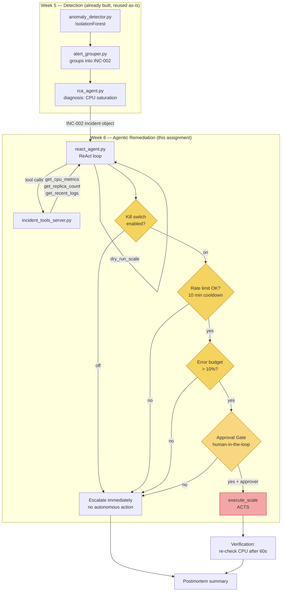

# Week 6 Assignment — Self-Healing `order-svc` Architecture

## Scenario

Unlike the Lab (a fabricated `payment-svc` deployment-regression alert), this
Assignment triages a **real incident from Week 5's pipeline**: `INC-002`, the
16-point CPU-saturation incident that `alert_grouper.py` produced from
`anomaly_detector.py`'s IsolationForest output.

| Field | Value |
|---|---|
| Incident ID | `INC-002` |
| Window | 11:20–11:35 (16 consecutive flagged points) |
| Peak CPU | 91.56% |
| Peak error rate | 0.149 |
| Peak latency | 3661.8ms |
| Week 5 RCA verdict | CPU saturation |

This is a **different failure mode than the Lab** on purpose: a bad deploy
(Lab) is fixed by rolling back; CPU saturation (Assignment) is fixed by
**scaling out** — which also ties directly back to Week 4's predictive
autoscaling work (KEDA `ScaledObject`, `minReplicaCount: 2` /
`maxReplicaCount: 10`). This agent is the reactive counterpart to Week 4's
proactive forecast-driven scaling: Week 4 scales *ahead* of a predicted
peak; this agent scales *in response to* a confirmed anomaly Week 5 already
diagnosed.

## Architecture

## Why scaling, not rollback, for this failure mode

`get_deployment_history` in the Lab's tool set exists to answer "did a
deploy cause this?" — for `INC-002`, Week 5's RCA already ruled that out
(the diagnosis was CPU saturation under load, not a code regression). Where
the Lab's decision tree ends at *rollback*, this one ends at *scale out*,
and only escalates to a human-designed fix (bigger instance type, code
optimization, etc.) if scaling alone can't clear the saturation — e.g. the
service is already at `maxReplicaCount`.

## Blast-radius controls (4 total — assignment requires ≥2 beyond the
approval gate)

1. **Dry-run** (`dry_run_scale`) — preview before any scaling call, same
   pattern as the Lab's `dry_run_rollback`.
2. **Approval gate** — human confirms before `execute_scale` runs
   (Autonomy Level 2, same as the Lab).
3. **Rate limit** — no more than one scaling action per service per 10
   minutes, so a flapping detector can't trigger a scaling storm.
4. **Error-budget gate** — refuses to act if `error_budget_remaining` is
   already below 10%; at that point the safer move is escalating to a
   human rather than an agent taking further autonomous action mid-crisis.
5. **Kill switch** — one environment variable
   (`AUTONOMY_KILL_SWITCH=off`) disables all autonomous remediation
   regardless of everything else.
