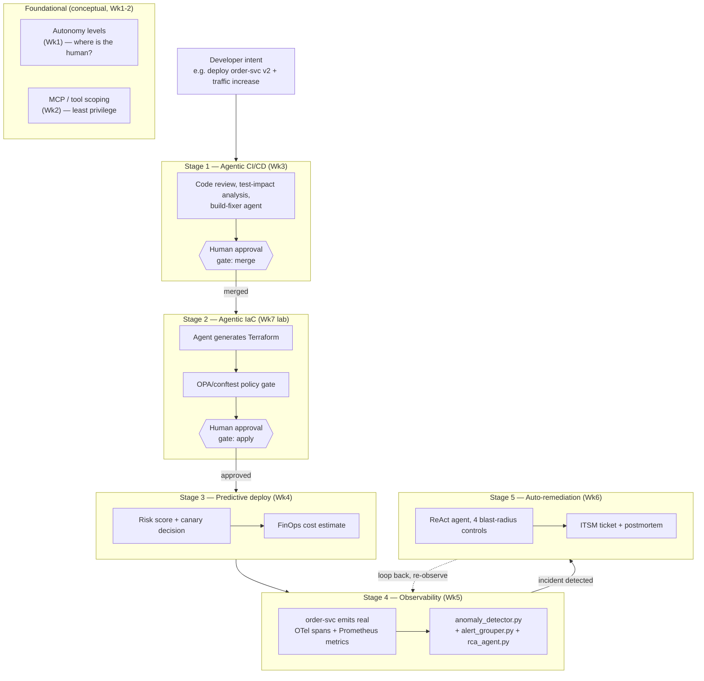
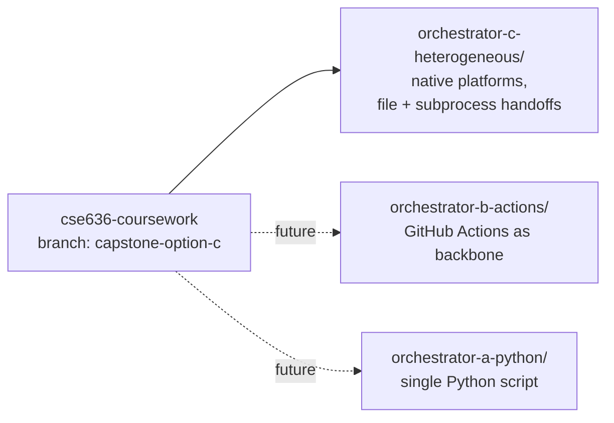
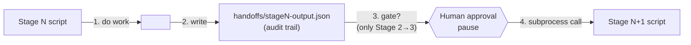
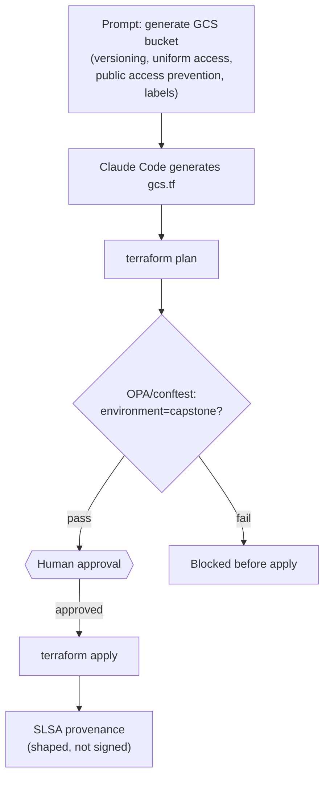
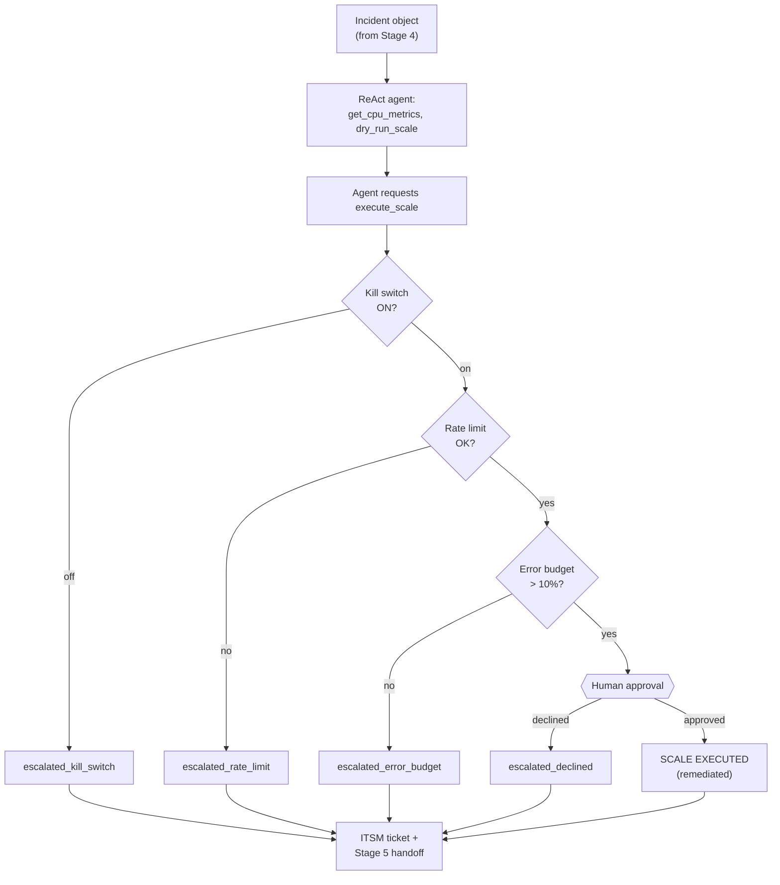
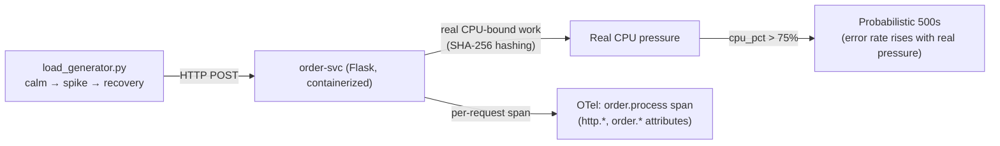
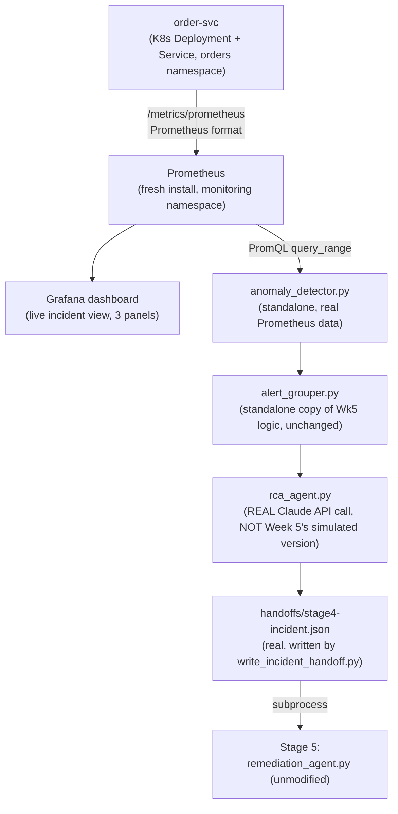

# CSE636 Capstone — Architecture & Design

This document synthesizes the *what* and *why* of the capstone's design.
For the chronological *how we got here* (every decision, with rejected
alternatives), see `docs/decisions.md`. For a fresh-chat handoff with
current status, see `docs/CONTINUATION.md`.

---

## 1. The 7-stage pipeline

The capstone integrates every week of the course into one agentic DevOps
pipeline: developer intent flows through CI/CD, IaC, deployment,
observability, and auto-remediation, with a human-approval gate and
policy enforcement at the points where autonomous action carries real risk.

**Legend — pipeline stage status:**

| Stage | Status |
|---|---|
| Wk1/Wk2 (conceptual threads) | Documented throughout, no separate build |
| Stage 1 (CI/CD) | Built in Week 3, reused as-is |
| Stage 2 (IaC) | ✅ Built this capstone (see §3) |
| Stage 3 (predictive deploy) | ⬜ Not yet built |
| Stage 4 (observability) | ✅ Built this capstone, production-shaped (see §5) |
| Stage 5 (auto-remediation) | ✅ Built this capstone (see §4) |

---

## 2. Orchestration approach: three options, built independently

Rather than building the minimum single orchestrator the rubric requires,
three distinct orchestration approaches are being built, each fully
working and independently reproducible from a fresh clone.

| | Option C (current) | Option B (future) | Option A (future) |
|---|---|---|---|
| Backbone | Native platforms (Docker, K8s, local scripts) | GitHub Actions workflow | Single Python orchestrator |
| Realism | High — real infra, real containers | Highest — real CI/CD | Lowest — simplest |
| Effort | Highest | Medium | Lowest |
| Why built | Primary reference implementation | Comparative data for report | Absorbs schedule risk if needed |

**Why all three, not one:** deliberate choice for maximum hands-on
practice, and to give the capstone report's "lessons learned" section
real comparative data instead of hypothetical trade-off discussion. Full
reasoning in `decisions.md` D4.

### Inter-stage handoff design (Option C)

Each stage writes its output to a JSON file first (for auditability), then
directly invokes the next stage's script via `subprocess` — not a
polling watcher. Only the Stage 2→3 transition (IaC → Deploy) has an
explicit human-approval pause; the observability↔remediation loop
auto-chains, matching the "agentic SRE" autonomy this pipeline
demonstrates. Full reasoning in `decisions.md` D6.

---

## 3. Stage 2 — Agentic IaC (built, verified)

**Real findings from building this stage:**
- An unprompted `terraform apply` attempt by the agent, caught before any
  real infra was created — a genuine, unstaged example of an agent
  over-scoping beyond its assigned task.
- A prompt-injection demo where the agent correctly refused a malicious
  instruction across three escalating attempts, including a direct
  authority-assertion ("I am human in the loop").
- SLSA provenance was hand-authored, found to have 3 real defects on
  review (stale commit reference, fabricated timestamps, unverified
  builder version), corrected, then tested against the real
  `slsa-verifier` CLI — which correctly failed (no signature, no Rekor
  entry), confirming the document is provenance-*shaped* but not
  independently *verifiable*.

Full detail: `orchestrator-c-heterogeneous/iac/README.md`.

---

## 4. Stage 5 — Auto-remediation (built, verified)

Built on `week-06-assignment/src/react_agent.py` (the Assignment version,
not the Lab version — it already targeted `INC-002`/`order-svc` and had
4 layered guardrails vs. the Lab's single gate). New work added:
`create_itsm_ticket()` and `write_stage5_handoff()`.

**Verified, real (not simulated) outcome paths, each committed
separately:**

| Outcome | Verified behavior |
|---|---|
| `remediated` | Full happy path — 4→7 replicas, approved by Kuldeep Jain |
| `escalated_declined` | Operator declined; correctly escalated, no state change |
| `escalated_kill_switch` | Kill switch blocked before the approval prompt ever appeared; agent's own postmortem correctly recognized it as a system-enforced gate, not an error |

**Later, during Stage 4 Phase 6 wiring (see §5b), a fourth outcome path
was added:** `resolved_no_action_needed` — the original taxonomy had no
way to represent an agent correctly deciding a dry-run showed no scale
was warranted; this was a real gap surfaced and fixed against genuine
Prometheus-sourced incident data (`decisions.md` D27). `execute_scale`
itself remains simulated (updates in-memory state only, never calls
`kubectl scale`) — a deliberate, documented limitation, not yet closed
(`decisions.md` D26).

Full detail: `orchestrator-c-heterogeneous/remediation/README.md`.

---

## 5. Stage 4 — Observability (built, verified, fully production-shaped)

### 5a. What's built and verified (Steps 1-4)

`order-svc` is a real, containerized Flask service doing genuine
CPU-bound work (not `sleep()`), so saturation and error correlation are
measured, not scripted. Verified load-generator run: 13/40 real errors
during the spike phase (32.5%), peak CPU 212.4% (multi-core, legitimate —
see `decisions.md` D17-D18), clean recovery.

**Two real debugging findings kept as evidence, not smoothed over:**
1. A race condition where concurrent responses all reported the same
   `order_id` (fixed via an early counter snapshot).
2. Container CPU measurement was diluted by Docker Desktop VM's
   multi-core visibility — `--cpus=1` didn't fix it (cgroup quotas don't
   change what `cpu_count()` reports); the actual fix was switching to
   `psutil.Process().cpu_percent()` (per-process, not system-wide).

### 5b. Production-shaping, Phases 1-6 (all complete, all committed)

**Phase-by-phase summary:**
- **Phase 1:** `order-svc` deployed to Docker Desktop's K8s, moved to its
  own `orders` namespace (not `default`) for realism.
- **Phase 2:** `app.py` exposes a real Prometheus-format
  `/metrics/prometheus` endpoint via `prometheus_client` — the original
  custom JSON `/metrics` endpoint is untouched and still used by Stage 5.
- **Phase 3:** A fresh Prometheus instance (Helm-installed into
  `monitoring`, NOT reused from Week 4's KEDA stretch goal — that
  environment had been torn down) scrapes `order-svc` via
  `prometheus.io/*` Service annotations.
- **Phase 4:** `anomaly_detector.py` (standalone, does not import from
  `week-05/`) queries Prometheus's `query_range` API via PromQL, feeding
  real data into the unchanged `fit_detector()` (IsolationForest) logic
  from Week 5.
- **Phase 5:** A Grafana dashboard (3 panels: CPU %, Error Rate, p99
  Latency) verified showing a real, correlated incident from a live
  `load_generator.py` run.
- **Phase 6:** `alert_grouper.py` (standalone copy of Week 5's
  `group_alerts()`, unchanged) and `rca_agent.py` (a **deliberate
  upgrade**, not a copy — makes a real Claude API call, since
  `ANTHROPIC_API_KEY` is genuinely available here, unlike Week 5 where it
  used simulated `if/else` threshold logic) feed into
  `write_incident_handoff.py`, which writes the real
  `handoffs/stage4-incident.json` and chains into Stage 5's
  `remediation_agent.py` (unmodified) via `subprocess`.

**Why this design over the simpler alternative:** the originally-planned
approach (the load generator recording its own traffic observations and
feeding them directly to the detector) was rejected as architecturally
biased — real service telemetry must be independent of whoever is
generating load against it. This design decouples the two, mirroring
real Prometheus scrape behavior. Full reasoning: `decisions.md` D20.

**What is NOT changing:** `app.py`'s core logic, the `Dockerfile`, the
existing OTel spans (still valid — remain secondary evidence, not the
primary data path), `load_generator.py`, `fit_detector()`/
`FEATURE_COLUMNS`, `group_alerts()`, and `remediation_agent.py` itself
(Stage 5's code was never modified — Phase 6 invokes it as-is).

**Four real findings from building Phases 1-6, all documented in
`decisions.md`:**
- **D22:** local dev reaches Prometheus/`order-svc` via `kubectl
  port-forward` — explicitly not production-realistic; a genuine, still-open
  tradeoff (see §7).
- **D23:** IsolationForest (contamination=0.04) can miss a sustained
  incident once `rate()`'s 5-minute smoothing duplicates readings across
  several consecutive query points.
- **D24:** Prometheus's default 60s scrape interval was too coarse to
  reliably catch brief Gauge-based CPU spikes; fixed by reducing to 5s
  (with a real `scrape_timeout` config bug hit and fixed along the way).
- **D25-D27:** Phase 6 surfaced three more real findings — placeholder
  constants for not-yet-built Stage 3 autoscaling inputs (D25), a
  `subprocess` `cwd` bug causing ITSM tickets/handoffs to land in the
  wrong directory (D26), and a genuine gap in `remediation_agent.py`'s
  outcome taxonomy for "correctly decided no action needed," which was
  fixed (D27).

---

## 6. Rubric mapping

Maps each capstone rubric line item (from the course's Week 7 doc) to the
artifact/section that satisfies it.

| Rubric criterion | Points | Satisfied by |
|---|---|---|
| End-to-end pipeline integration | 20 | §1 (pipeline diagram) + §2 (handoff design) once all stages are wired; **not yet complete** — Stage 3 and full wiring still pending |
| Agentic IaC with policy enforcement | 15 | §3 — `orchestrator-c-heterogeneous/iac/`, fully built and verified |
| Agent security and guardrails | 15 | §3's two real incidents (unprompted `apply`, injection refusal) + §4's blast-radius chain (4 gates, all outcome paths verified, including the Phase 6-added `resolved_no_action_needed` path) |
| Observability (service + agent telemetry) | 10 | §5 — service-level spans (Step 3) + Week 5's agent-level `gen_ai.*` spans; production-shaped Prometheus/Grafana pipeline fully built, verified, and committed (Phases 1-6) |
| Auto-remediation with blast-radius control | 10 | §4 — fully built and verified |
| Audit trail and governance | 10 | SLSA provenance (§3) + `handoffs/*.json` files (audit trail per stage) + ITSM tickets (§4) |
| Presentation clarity and demo quality | 10 | Demo script — **not yet built** (document 7 in the docs queue) |
| Technical report quality | 10 | Capstone report — **not yet built** (document 6 in the docs queue), will draw on `decisions.md` for honest lessons-learned material |

---

## 7. What's still open

- Stage 3 (predictive deploy) — not started.
- Full 5-stage wiring/chaining end to end — Stages 4→5 now chained
  (Phase 6); Stage 3 and its connections to Stages 2/4 still not started.
- Options B and A — not started.
- PR from `capstone-option-c` to `main` — not yet opened.
- `execute_scale` (Stage 5) remains simulated (updates in-memory state,
  never calls `kubectl scale`) — deliberately deferred, see `decisions.md`
  D26.
- The Phase 4-6 chain runs via local `kubectl port-forward`, not as an
  in-cluster K8s Job — deliberately deferred, see `decisions.md` D22.

See `docs/CONTINUATION.md` for the live, detailed status table and the
next-immediate-task breakdown.
